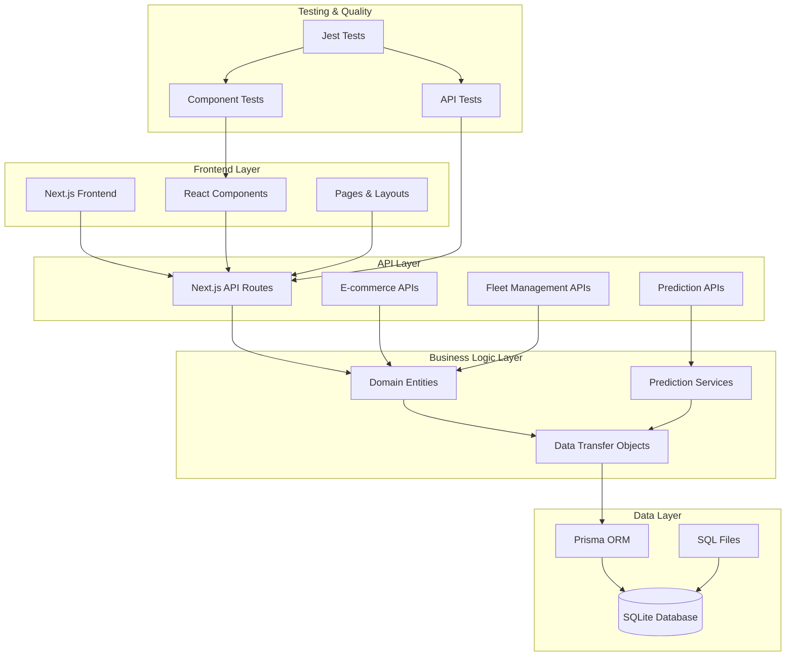
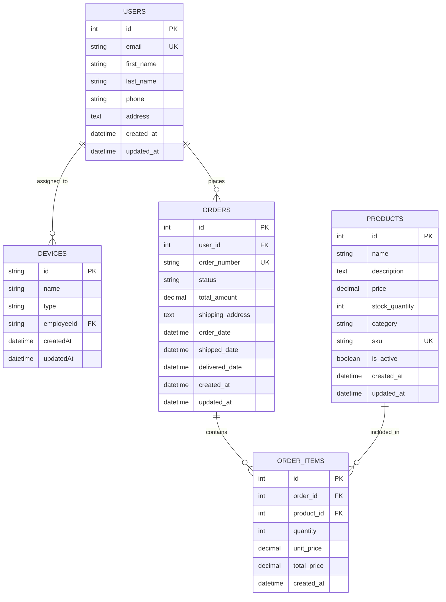
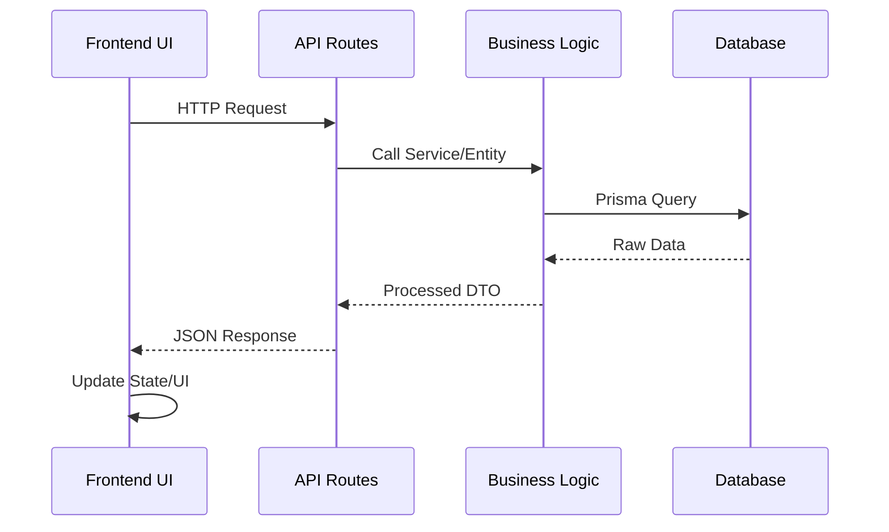

# Architecture Système - Fleet Management & E-commerce

Ce document décrit l'architecture technique de l'application unifiée de gestion de flotte et e-commerce.

## 🏗️ Vue d'ensemble de l'Architecture



## 🚀 Architecture Technique

### Frontend (Next.js 15)
- **Framework**: Next.js avec App Router
- **Styling**: Tailwind CSS 4.1
- **Language**: TypeScript
- **Components**: React fonctionnels avec hooks

### Backend (API Routes)
- **Framework**: Next.js API Routes
- **Language**: TypeScript
- **Architecture**: Clean Architecture
- **Patterns**: Repository, Service, DTO

### Base de Données
- **ORM**: Prisma
- **Database**: SQLite (dev) / PostgreSQL (prod)
- **Migrations**: SQL-first approach
- **Seeding**: Prisma seed scripts

## 📊 Structure des Données



## 🔄 Flux de Données



## 📁 Structure du Projet

```
fleet-case/
├── src/
│   ├── app/                    # Next.js App Router
│   │   ├── api/               # API Routes
│   │   │   ├── ecommerce/    # E-commerce endpoints
│   │   │   ├── fleet/        # Fleet management endpoints
│   │   │   └── predictions/  # Sales prediction APIs
│   │   ├── globals.css       # Styles globaux
│   │   ├── layout.tsx        # Layout racine
│   │   └── page.tsx          # Page d'accueil
│   ├── domain/
│   │   └── entities/         # Entités métier
│   └── dtos/                 # Data Transfer Objects
├── prisma/
│   ├── schema.prisma         # Schéma Prisma
│   └── seed.ts              # Script de seeding
├── sql/                      # Fichiers SQL source
│   ├── structure.sql         # Structure et données
│   ├── query.sql            # Requêtes d'analyse
│   └── sales-prediction.ts  # Algorithme de prédiction
├── tests/                    # Tests unitaires et d'intégration
└── docs/                     # Documentation
```

## 🛠️ Technologies Utilisées

### Frontend
- **Next.js 15**: Framework React avec SSR/SSG
- **TypeScript**: Typage statique
- **Tailwind CSS 4.1**: Framework CSS utilitaire
- **React**: Bibliothèque UI

### Backend
- **Next.js API Routes**: Endpoints RESTful
- **Prisma ORM**: Mapping objet-relationnel
- **SQLite**: Base de données (développement)
- **TypeScript**: Typage backend

### DevOps & Testing
- **Jest**: Framework de tests
- **pnpm**: Gestionnaire de paquets
- **ESLint**: Linting JavaScript/TypeScript
- **Prettier**: Formatage du code

## 🔐 Sécurité

### Authentification
- Session-based auth (future)
- JWT tokens (future)
- Role-based access control

### Validation
- Input validation avec Zod
- SQL injection prevention (Prisma)
- XSS protection (Next.js)

## 📈 Performance

### Frontend
- Server-Side Rendering (SSR)
- Static Site Generation (SSG)
- Code splitting automatique
- Image optimization

### Backend
- Database indexing
- Query optimization (Prisma)
- Caching strategies
- Connection pooling

## 🚀 Déploiement

### Développement
```bash
pnpm install
pnpm dev
```

### Production
```bash
pnpm build
pnpm start
```

### Variables d'Environnement
- `DATABASE_URL`: URL de connexion à la base
- `NODE_ENV`: Environnement (dev/prod)
- `NEXTAUTH_SECRET`: Secret pour l'auth (future)

## 🔄 Workflow de Développement

1. **SQL First**: Écriture des structures SQL
2. **Prisma Sync**: `prisma db pull` pour synchroniser
3. **Code Generation**: `prisma generate` pour les clients
4. **Development**: Développement des features
5. **Testing**: Tests unitaires et d'intégration
6. **Deployment**: Déploiement continu

## 📊 Monitoring & Analytics

### Métriques Business
- Ventes par jour/mois
- Produits les plus vendus
- Prédictions de ventes
- Performance des employés

### Métriques Techniques
- Temps de réponse API
- Erreurs système
- Utilisation de la base de données
- Performance frontend

## 🔮 Évolutions Futures

### Fonctionnalités
- Authentification utilisateur
- Dashboard analytics avancé
- API GraphQL
- Notifications en temps réel

### Architecture
- Microservices
- Event-driven architecture
- Containerisation (Docker)
- CI/CD pipeline

### Scaling
- Database sharding
- Load balancing
- CDN integration
- Caching layers (Redis)