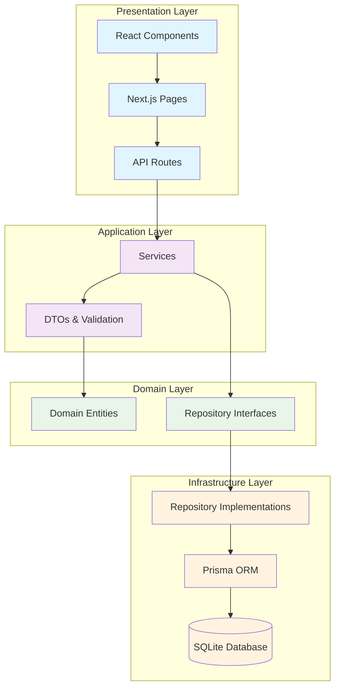
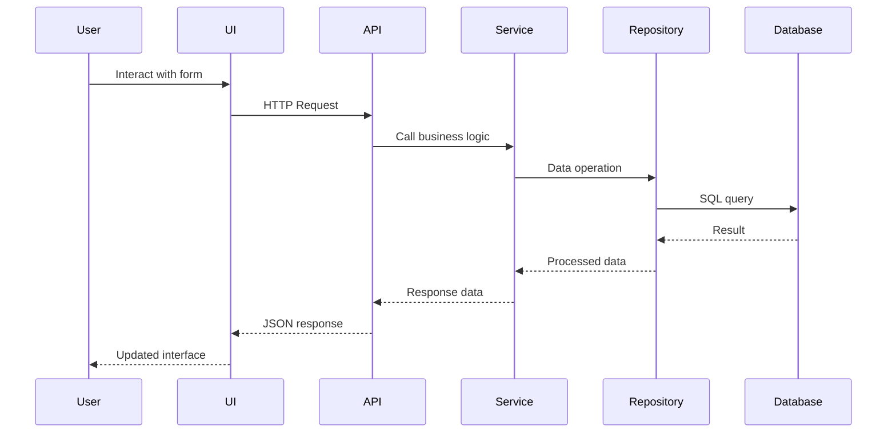
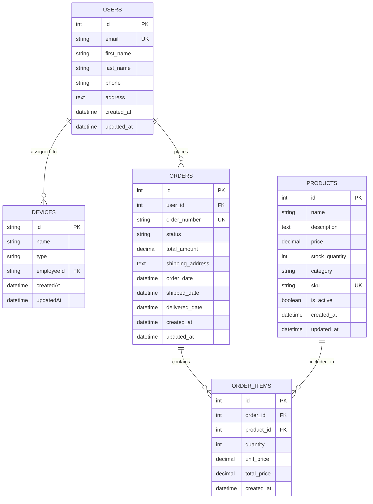

# Fleet Management System - Technical Case Study

A full-stack fleet management application with integrated e-commerce functionality, demonstrating modern web development practices and clean architecture.

## 🚀 Features

- **Employee Management**: Unified user system for employee tracking
- **Device Management**: Fleet equipment assignment and tracking
- **E-commerce Integration**: Product catalog and order management
- **Sales Analytics**: Data analysis and prediction capabilities
- **Responsive Design**: Full mobile and desktop compatibility
- **Clean Architecture**: Domain-driven design with separation of concerns
- **Type Safety**: Full TypeScript implementation with Zod validation

## 🛠 Tech Stack

- **Frontend**: Next.js 15, React 19, TypeScript
- **Styling**: Tailwind CSS 4.1
- **Database**: SQLite with Prisma ORM (unified schema)
- **Validation**: Zod for schema validation
- **Testing**: Jest with component and API testing
- **Icons**: Lucide React
- **Package Manager**: pnpm

## 📐 Architecture

This application follows Clean Architecture principles with clear separation of concerns:



## 🏗 Project Structure

```
src/
├── app/                    # Next.js App Router
│   ├── api/               # API routes
│   │   ├── ecommerce/     # E-commerce endpoints
│   │   └── fleet/         # Fleet management endpoints
│   ├── employees/         # Employee management page
│   ├── devices/           # Device management page
│   ├── layout.tsx         # Root layout
│   ├── page.tsx           # Homepage
│   └── globals.css        # Global styles
├── domain/               # Domain layer
│   └── entities/         # Domain entities (User, Product, Order, etc.)
├── dtos/                 # Data Transfer Objects
└── lib/                  # Utility libraries

prisma/                   # Database layer
├── schema.prisma         # Unified database schema
└── seed.ts              # Database seeding

sql/                      # SQL-first approach
├── structure.sql         # Database structure & sample data
├── query.sql            # Analysis queries
├── sales-prediction.ts   # AI prediction algorithms
└── README.md            # SQL documentation

tests/                    # Testing suite
├── api/                 # API endpoint tests
└── components/          # Component tests
```

## 🔄 Data Flow



## 📊 Unified Database Schema



## 🚀 Getting Started

### Prerequisites

- Node.js 18+ 
- pnpm

### Installation & Database Setup

1. **Clone the repository**
   ```bash
   git clone <repository-url>
   cd fleet-case
   ```

2. **Install dependencies**
   ```bash
   pnpm install
   ```

3. **Start the development server**
   ```bash
   pnpm dev
   ```

4. **Initialize the database via the interface (Recommended)**
   - Navigate to [http://localhost:3000](http://localhost:3000)
   - The application will automatically detect if database initialization is needed
   - Use the interface to initialize the database with sample data from SQL files
   - This approach uses the `sql/structure.sql` file as the source of truth

5. **Alternative: Initialize via Prisma (Optional)**
   ```bash
   # Only if you prefer not to use the web interface
   pnpm db:generate
   pnpm db:push
   pnpm db:seed
   ```

> **Note**: The application uses SQLite for development with a unified schema approach. The web interface provides a SQL-first workflow where `sql/structure.sql` serves as the source of truth, then syncs to Prisma automatically.

## 📝 API Endpoints

### Fleet Management

- `GET /api/fleet/employees` - Get all employees with device assignments
- `POST /api/fleet/employees` - Create a new employee
- `GET /api/fleet/devices` - Get all devices (with optional filters)
- `POST /api/fleet/devices` - Create and assign a new device
- `PUT /api/fleet/devices/[id]` - Update device assignment

### E-commerce

- `GET /api/ecommerce/query` - Execute custom SQL queries for analysis
- `GET /api/ecommerce/status` - Get system and database status
- `POST /api/ecommerce/init` - Initialize database from SQL files
- `GET /api/ecommerce/predictions` - Get AI-powered sales predictions

### Database Management

- `POST /api/ecommerce/init` - SQL-first database initialization
- `GET /api/ecommerce/status` - Health check and schema validation

## 🔍 Features in Detail

### Unified User Management
- Users serve dual purpose: customers and employees
- Full CRUD operations with validation
- Device assignment tracking for employees
- Order history for customers
- Comprehensive contact information

### Fleet Management
- Device inventory with real-time assignment status
- Equipment categorization (Laptop, Desktop, Phone, Tablet, etc.)
- Employee assignment tracking
- Filter by type, owner, or unassigned devices
- Asset management and audit trails

### E-commerce Integration
- Product catalog with inventory management
- Order processing and status tracking
- Customer relationship management
- Sales analytics and reporting

### Analytics Features
- Sales data analysis and basic predictions
- Trend analysis with SQL queries
- Business reporting capabilities

### Data Validation
- Schema validation using Zod
- Type-safe API endpoints
- Client and server-side validation
- Consistent error handling

## 🏛 Clean Architecture Benefits

1. **Separation of Concerns**: Each layer has a specific responsibility
2. **Testability**: Easy to unit test business logic
3. **Maintainability**: Changes in one layer don't affect others
4. **Scalability**: Easy to add new features or modify existing ones
5. **Type Safety**: TypeScript ensures compile-time error checking

## 🛡 Security & Validation

- Input validation with Zod schemas
- SQL injection prevention through Prisma
- Type-safe database operations
- Error boundary handling

## 📱 Responsive Design

The application is fully responsive with:
- Mobile-first approach
- Flexible grid layouts
- Touch-friendly interactions
- Optimized for all screen sizes

## 🔧 Available Scripts

- `pnpm dev` - Start development server
- `pnpm build` - Build for production
- `pnpm start` - Start production server
- `pnpm lint` - Run ESLint
- `pnpm db:generate` - Generate Prisma client
- `pnpm db:push` - Push schema to database
- `pnpm db:studio` - Open Prisma Studio

## 🧪 Testing

The project includes testing setup for:
- Unit tests for services and repositories
- Component testing for React components
- API endpoint testing

## 🚀 Deployment

The application can be deployed on any platform that supports Next.js:
- Vercel (recommended)
- Netlify
- AWS
- Docker containers

## 🔮 Technical Highlights

This project demonstrates:

### Architecture Patterns
- **Clean Architecture**: Clear separation between presentation, business, and data layers
- **Domain-Driven Design**: Entities and DTOs representing business concepts
- **SQL-First Approach**: Database schema defined in SQL, then synchronized to ORM

### Modern Technologies
- **Next.js 15**: Latest React framework with App Router
- **TypeScript**: Full type safety across frontend and backend
- **Prisma**: Type-safe database access with automated client generation
- **Tailwind CSS**: Utility-first styling with responsive design

### Development Practices
- **Testing**: Unit tests for components and API endpoints
- **Validation**: Schema validation with Zod
- **Code Quality**: ESLint and TypeScript for code consistency
- **Database Management**: Automated sync between SQL files and ORM schema