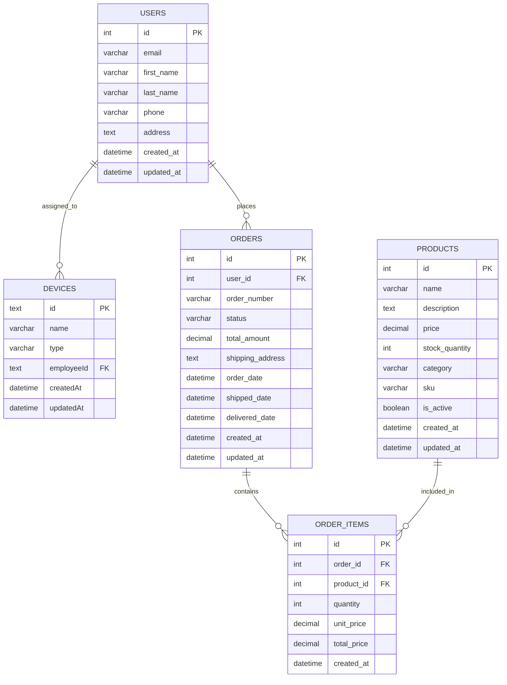
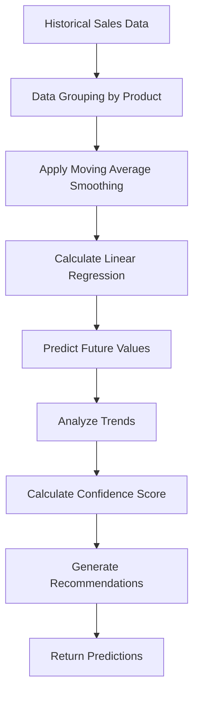

# Unified Database: E-commerce & Fleet Management

This directory contains the SQL implementation for the Fleet Management technical test, including unified database structure, queries, and sales prediction algorithm.

## 📁 Files Overview

- **`structure.sql`** - Database schema with sample data
- **`query.sql`** - Required SQL queries for data analysis  
- **`sales-prediction.ts`** - Advanced sales prediction algorithm
- **`README.md`** - This documentation file

## 🗄 Unified Database Schema



## 📊 Step 1: Unified Database Structure

The database includes:

- **Users**: Customer/Employee information with contact details (unified concept)
- **Devices**: Fleet management equipment assigned to users
- **Products**: Product catalog with pricing and inventory
- **Orders**: Order tracking with status and totals
- **Order Items**: Individual items within each order

### Sample Data

- 8 sample users with French addresses (serve as both customers and employees)
- 10 devices including laptops, phones, tablets, monitors, and peripherals
- 10 products including PRODUCT_1 through PRODUCT_10
- 15 orders with recent transactions for PRODUCT_1
- Complete order items linking products to orders

## 🔍 Step 2: Required Queries

### Query 1: Users who bought PRODUCT_1 in the past 7 days

```sql
SELECT DISTINCT u.email
FROM users u
JOIN orders o ON u.id = o.user_id
JOIN order_items oi ON o.id = oi.order_id
JOIN products p ON oi.product_id = p.id
WHERE p.name = 'PRODUCT_1'
  AND o.order_date >= datetime('now', '-7 days')
  AND o.order_date <= datetime('now')
ORDER BY u.email;
```

**Expected Results:** Email addresses of customers who purchased PRODUCT_1 recently.

### Query 2: Total sales amount per day

```sql
SELECT 
    DATE(o.order_date) as sales_date,
    SUM(o.total_amount) as total_sales_amount,
    COUNT(o.id) as number_of_orders,
    COUNT(DISTINCT o.user_id) as unique_customers
FROM orders o
WHERE o.status IN ('delivered', 'shipped', 'pending')
GROUP BY DATE(o.order_date)
ORDER BY sales_date DESC;
```

**Expected Results:** Daily sales summary with totals, order counts, and customer metrics.

## 🤖 Step 3: Sales Prediction Algorithm

### Algorithm Features

1. **Linear Regression**: Calculates sales trends using least squares method
2. **Moving Averages**: Smooths data to reduce noise
3. **Trend Analysis**: Identifies increasing, decreasing, or stable patterns
4. **Confidence Scoring**: Measures prediction reliability based on data consistency
5. **Seasonal Detection**: Identifies weekly and monthly patterns
6. **Smart Recommendations**: Provides actionable business insights

### Prediction Process



### Algorithm Classes

- **`SalesPredictionService`**: Basic prediction using linear regression
- **`AdvancedSalesPredictionService`**: Enhanced with seasonal adjustments

### Prediction Output

For each product, the algorithm provides:
- Current trend direction (increasing/decreasing/stable)
- Predicted daily, weekly, and monthly sales
- Confidence score (0-1)
- Business recommendations

### Example Usage

```typescript
const predictionService = new AdvancedSalesPredictionService();
const predictions = await predictionService.predictSalesWithSeasonality(historicalData);

predictions.forEach(prediction => {
  console.log(`Product: ${prediction.product_name}`);
  console.log(`Predicted Daily Sales: $${prediction.predicted_daily_sales}`);
  console.log(`Confidence: ${(prediction.confidence_score * 100).toFixed(1)}%`);
  console.log(`Recommendation: ${prediction.recommendation}`);
});
```

## 📈 Advanced Analytics

### Additional Queries Provided

1. **Sales Summary (30 days)**: Rolling sales with cumulative totals
2. **Product Performance**: Revenue and quantity analysis by product
3. **Customer Analysis**: Customer behavior for PRODUCT_1 buyers
4. **Weekly Trends**: Week-over-week sales patterns
5. **Monthly Summary**: Monthly sales aggregation

### Seasonal Analysis

The advanced algorithm detects:
- **Weekly Patterns**: Day-of-week sales variations
- **Monthly Patterns**: Monthly sales cycles
- **Trend Adjustments**: Seasonal corrections to predictions

## 🎯 Business Intelligence Features

### Confidence Scoring

Confidence is calculated based on:
- Data consistency (lower variance = higher confidence)
- Prediction bounds (realistic vs. historical range)
- Sample size (more data = higher confidence)

### Recommendation Engine

Generates specific recommendations:
- **Increasing Trend**: Inventory and marketing suggestions
- **Decreasing Trend**: Pricing and promotion recommendations  
- **Stable Trend**: Maintenance strategy advice
- **Low Confidence**: Data collection guidance

## 🚀 Implementation Notes

### Database Compatibility

- Primary implementation: SQLite (for development)
- Compatible with: PostgreSQL, MySQL
- Uses standard SQL features for portability

### Performance Optimizations

- Indexed columns for fast queries
- Efficient date range filtering
- Optimized joins for large datasets

### Data Requirements

For accurate predictions:
- Minimum 14 days of historical data
- Daily sales transactions
- Product categorization
- Order status tracking

## 📊 Sample Results

Based on the sample data, you would expect:

### PRODUCT_1 Buyers (Last 7 Days)
- john.doe@example.com
- jane.smith@example.com  
- pierre.martin@example.com
- luc.bernard@example.com
- thomas.petit@example.com

### Daily Sales Totals
- Recent days showing various sales amounts
- Pattern analysis for trend identification
- Customer behavior insights

### Predictions
- PRODUCT_1: Strong performance with increasing trend
- Various products with different confidence levels
- Actionable business recommendations

## 🔧 Setup Instructions

1. **Create Database**: Run `structure.sql` to create unified tables and insert sample data
2. **Run Queries**: Execute queries from `query.sql` for analysis
3. **Implement Prediction**: Use `sales-prediction.ts` for future forecasting
4. **Fleet Management**: Users table serves dual purpose (customers + employees)
5. **Device Assignment**: Track equipment allocation through devices table

## 📝 Future Enhancements

- Machine learning integration (neural networks)
- External factors (seasonality, promotions, holidays)
- Real-time prediction updates
- A/B testing framework
- Advanced statistical models (ARIMA, Prophet)

## 🧪 Testing

The SQL queries and prediction algorithm can be tested with:
- Sample data provided in structure.sql
- Edge cases (no data, single data point)
- Performance testing with larger datasets
- Accuracy validation against known outcomes